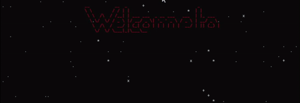

### First Year Seminar - Drake University - Fall 2024

### Welcome to Aesthetics of Computing! My name is Andrei - I am your professor - and I am so excited to have you in my class and to get to know you over the next weeks and months! Please make sure to read the entirety of the syllabus below, so you can know our policies, what's expected of you, what you can expect from me, and what the class is going to be about!

# > ...
# > ...
# > ...

# COURSE OBJECTIVES
## We have one mission this semester: to analyze the vibes of all things computing-related. That's a pretty big umbrella. That means we have to narrow it down to a collection of things that we can talk about in one semester.

Some of our topics: computer marketing, the hacker aesthetic, AI-generated images, computer music, aesthetic theory, gaming, pixel art, and many more.

Some of our philosophical questions: what is beauty and how does it manifest in the design of computers and related things? why do themes like cyberpunk and hacking have such draw? how is understanding something aesthetically related to understanding its function? how does it go beyond? what do we mean in philosophy by 'form' and 'content'? how do the appearances of things affect how we understand those things? what is the nature of the appeal of electronic and other 'computer music'? what do machines and technology make us feel in art that utilizes those themes? what is a video game? how does nostalgia for the past affect how we think and feel about older technologies?

# > ...
# > ...
# > ...

# ATTENDANCE

You are expected to attend every class. Two absences are excused by default (for these, you do not have to ask me or let me know you will be gone). Any absences beyond the first two must be documented. For that reason, it's actually better to document <i>all</i> of your absences - to avoid having to use up the 'freebies'. Documenting your absence means having some proof that your absences was a valid one - illness, job interview, etc. Proof is any clear evidence that you are gone for the reason you say - a doctor's note with a date and reason for visit, an interview letter that shows the date of your interview, etc. Not every absence can be or needs to be documented (e.g. - I do not require documentation for absence due to the passing of a loved one, which unfortunately happens.) These absences are 'covered' by the two 'free' absences. You are always welcome to communicate with me about your attendance needs, and I am always willing to hear you out.

Attendance is part of the 'engagement' portion of your grade and unexcused absences will negatively affect your grade. Please see the 'grading' page of the course website for more detail.

# > ...
# > ...
# > ...

# THE AVERAGE DAY OF CLASS

Class time consists of discussion, writing, and looking back at selected passages from the readings. It is <b> not </b> the place to do the reading assignments (these have to be compelted <b> before </b> class). 

In discussions, I will usually give you some questions to think about, and you'll talk to each other in small groups. Then we'll see if we can make progress on those questions in class. 

After some discussion, I will give you some time to work on <i> low-stakes </i> writing. Think of this as a journal for <i> you </i>

# GUIDELIES FOR DISCUSSION, READING, AND THIS CLASS IN GENERAL

0. Be respectful and polite towards everyone. There is a 0% chance that we will all agree on everything, and sometimes we might be very serious about those disagreements to `boot`. You can believe your beliefs, even be certain of them, and still be unable to change anyone's mind. That does not mean you can resort to any sort of rude behavior or name-calling. It is absolutely out of the question. You must be respectful of your classmates. From the other side - sometimes another person's belief looks like a direct assault on ours (sometimes it is). We have to make an effort to accept others' shortcomings (whether it's that they are wrong (!!!) or aren't being particularly gentle) with grace and patience. Please come to the instructor with any serious interpersonal problems - I am always happy to hear you out and talk.

1. Not all questions need or have definitive answers. They need to be thought about and "chewed" thoroughy. Our goal is to see things in new, different, and interesting ways, and to understand aesthetics. That means sitting with a question for a while.

2. The quality of discussion is proportional to the care with which you did the reading. If most people did not read the text very closely, or did not take good notes on it and think about it, then we aren't going to be able to have a quality discussion. 