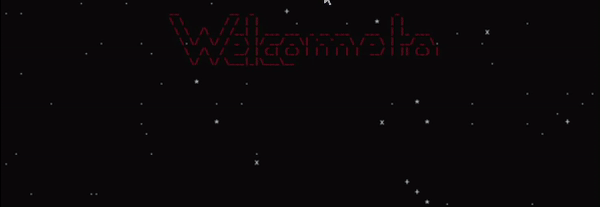

>"What does a scanner see? he asked himself. I mean, really see? Into the head? Down into the heart? Does a passive infrared scanner like they used to use or a cube-type holo-scanner like they use these days, the latest thing, see into me - into us - clearly or darkly? I hope it does, he thought, see clearly, because I can't any longer these days see into myself. I see only murk. Murk outside; murk inside. I hope, for everyone's sake, the scanners do better. Because, he thought, if the scanner sees only darkly, the way I myself do, then we are cursed, cursed again and like we have been continually, and we'll wind up dead this way, knowing very little and getting that little fragment wrong too." (Philip K. Dick, <i> A Scanner Darkly </i>)

### CS 87: Aesthetics of Computing, Fall 2026

### Welcome to Aesthetics of Computing! My name is Andrei - I am your professor - and I am so excited to have you in my class and to get to know you over the next weeks and months! Please make sure to read the entirety of the syllabus (course policies and information) below, so you can know our policies, what's expected of you, what you can expect from me, and what the class is going to be about!

# > `...` `accessing Syllabus.txt`
# > `...`
# > `... loading ...`

# COURSE DESCRIPTION 

Introduction to the study of computing objects and experiences from the standpoint of aesthetics and rhetoric. The focus of this course is the study of the nature of beauty and other aesthetic phenomena in machines, in technology, and in computing devices. Attention is paid to the phenomenology of aesthetic experience, everyday objects such as phones and personal computers, and cultural experiences with technology. Topics are variable and include videogames, algorithmically generated artwork, and the cyberpunk genre. Examinations of technology and computing in art, music, and film. You can find detailed justifications for the specific topics of the course, as well as related discussion questions, [here](https://docs.google.com/spreadsheets/d/1IJnKhUbO300HY-U8IuIayjQd-wuzVfdqguXDsl6y1kw/edit?usp=sharing).

You might also think an important topic, reading, idea, or even particular aesthetic object (a song, picture, movie) is missing. If so, tell me! Convince me it matters, and maybe it can be incorporated into the class.

# PROFESSOR INFO

Andrei Migunov
Office: Collier-Scripps Room 321
Email: firstname dot lastname at drake dot edu

# ACADEMIC INTEGRITY

All students are expected to know and abide by the <a href="https://www.drake.edu/studentlife/handbook-resources/handbook/academic/">Drake University Academic Integrity Policy (click here to read)</a>.

All solutions prepared with the aid of any source, however minor, must specifically cite those sources and explain the relationship of the submitted solution to the source. All citations must include author names, titles, publication information, and links to electronic sources when they exist. When in doubt, be open and transparent about the use of sources. This will shift the issue away from a question of academic integrity penalties to a question of how many points to award for your contributions. A violation of the course's collaboration policy will also be considered an academic integrity violation. Citation is not hard to do and it is expected on all work.

If I suspect cheating or failure to properly credit authorship on any assessment or in a discussion, I will request an in-person conversation with you. You must come to my office hours and discuss this with me within one (1) week of the grade being made available to you (or of my request), otherwise it will be logged and forwarded to the Chair of the Computer Science Department, and then the Dean of Arts and Sciences. The minimum penalty for any violation of academic integrity will be a forfeiture of all points on the entire assignment or exam in question. Depending on the severity of the violation, an `F' for the course may be given. Any student caught cheating, failing to produce correct citations, or engaging in any other forms of academic dishonesty also forfeits any and all opportunities for extra credit in the course upon the very first violation, including all previously earned credit.

# ARTIFICIAL INTELLIGENCE AND LLM POLICY

Use of artificial intelligence in the form of LLMs (large language models) and agentic assistants in this course in any capacity whatsoever is discouraged, and use of AI for the purposes of writing graded work and for both spoken or written discussion contributions is **forbidden completely** and will be treated as academic dishonesty, potentially incurring a 0 grade or an F in the course. Good writing is good thinking - it is against the interest of your personal self-development as a human being to have something else perform either one of these for you, no matter what stage of development you are in as a person, thinker, or writer. The things that make learning difficult are not standing in the way of your learning. They *are* your learning. These two things are not incidental to each other, they are *the same thing*. 

# READING, VIEWING, AND LISTENING

Reading is a major part of this course, possibly the most important part. Reading does not mean simply parsing the words on the page. It means thinking carefully in order to understand their meaning. This is a basic responsibility and cannot be waived. If you are not willing to do it, please drop the course. It is *your* job to try to understand our readings, I expect it from you, and they cannot be 'digested' *for* you by someone else. If you don't try your absolute best to understand them, then we cannot discuss them. You will read material that is challenging, and you might see words you are not familiar with. It is your responsibility to look them up and figure out on your own what they mean before asking for help. That said, don't get hung up on every little thing all the time. Exercise your best judgment to decide how you read, when you really need to look something up, when it's an inessential thing you can skip over at least for now, etc. Use context and judgment. Read slowly and carefully, and always read the entire assigned reading. When you finish reading something, rephrase it in your own words to yourself. Sometimes you can't do that on the first pass, and you need to take another look. Take notes on what you read - make note of questions you have and ideas you have.  

Some days, in addition to reading, we will watch movies or videos, or look at some art, or listen to some music. In some ways, this is "reading," too. It requires focus, care, and an attempt to <i>experience</i> those things and <i>understand</i> the ideas they express. I expect you to do your best. Part of the fun of this class is comparing how you "read" such things <i> aesthetically </i> to how others do.

<a href="https://1000wordphilosophy.com/teaching/reading/"> Some good tips on reading </a>

# WRITING

<!-- We could have a whole semester course on just the question: "what is writing?". For now, let's just stick with what our writing should *do*. 

We write for others and for ourselves. We can write to lay out and better organize our own (often jumbled and confused) ideas and thoughts. This fits with our personal journaling in-class activity: we use this time and our writing to get a grasp on what we're thinking and feeling. We can write to convince others of a claim or really flesh out a coherent feeling or experience, to resolve contradictions in our thoughts and beliefs where they don't naturally line up with each other - this is the focus of your term paper. Your final paper is a very ambitious thing - it aims to put an idea or a claim in the most "honest light," to defend an idea thoroughly and convince others of it, to show ourselves and others the full richness and force of an aesthetic experience or idea. This is the final product of our writing at the end of the semester - the final paper. Whether we write for others or for ourselves, writing makes us better, more accountable people and helps us see the world more clearly.  -->

Good writing tries to show us something new, tries to anticipate what our readers might already think (or doubt), tries to explain ideas more clearly than they've been explained before, and much more. It goes well beyond academic and persuasive writing. There are a lot of things good writing can do, and you can shoot for any combination of them. Write the kinds of things you'd want to read - find not just your voice, but the shape of that voice and find out what kind of writer you want to be. 

With that in mind, know that one main goal in this class is to become better, clearer, and more able to communicate ideas to other people so that they understand them.

Another thing to consider, however:

>*At heart, write always for yourself, not for family and friends, for admired teachers, for reviewers or publishers; but make sure you write from your real self, not that one besotted by vainglorious dreams of a future self. One day you will realise that the true rewards of writing lie inalienably in the writing itself.* (John Fowles)

# ATTENDANCE

Attendance and participation determine the 'discussion' portion of your grade and absences - "valid" or not - will negatively affect your grade. Please see the 'grading' page of the course website for more detail.

# OFFICE HOURS

Office hours are a time to talk to the professor, get clarification, ask questions, talk through ideas and concepts, solve problems, etc. You are welcome at my office hours and I'd love to see you there. My office hours are always in Collier-Scripps Room 321. I can also set office hours by appointment - so if you *can't make it* to the standard office hours, please email me and let's set up a time! I promise it's no inconvenience - and time spent in office hours can be very rewarding!

My office hours are always available at [this link](bit.ly/46DXeZT), and are updated each week. 

# THE AVERAGE DAY OF CLASS

Class time consists mostly of discussion, some writing, and looking back at selected passages from the readings. It is <b> not </b> the place to do the reading assignments (these have to be completed <b> before </b> class). You are expected to make a meaningful contribution to the discussion at least once a week. The best way to do that is to prepare something to say in advance, not to try to wing it during class. Part of your discussion points are based on the quality and sometimes accuracy of your contributions.

Note: Quizzes may be given (though I would prefer not to) if I get the sense that some portion of the class are not doing the reading. These will affect the participation portion of the grade up to 20% of the course grade, and will cover material from the reading.

# GUIDELINES FOR DISCUSSION, READING, AND THIS CLASS IN GENERAL

> *Real friends care little for forms. They argue openly, confident in the knowledge that they can inflict no wounds. Where communication is genuinely sought, misunderstandings are no crime. But if you accost me armed to the teeth, understanding agreement only in terms of a victory for you, then you will get nothing out of me but an evasive pose, and a silence signalling that discussion is ended.* (Raoul Vaneigem)

1. <b>Safety</b>: Please come to the instructor with any serious interpersonal problems - I am always happy to hear you out and talk, and I will take any serious issues seriously. If you have a concern, especially regarding your safety or someone else's, please reach out to me to discuss it privately, and it will be addressed.

2. <b>Respectful disagreement</b>: There is a 0% chance that we will all agree on everything, including things we feel strongly about. You can (and should!) believe your beliefs, even be certain of them, and still be unable to change anyone's mind. That does not mean you can resort to any sort of rude behavior or name-calling. It is absolutely out of the question. You must be respectful of your classmates. From the other side - sometimes another person's belief looks like a direct assault on ours (sometimes it is). We have to make an effort to accept others' shortcomings (whether it's that they are wrong (!!!) or aren't being particularly gentle) with grace and patience. 

3. <b>Studying the debate</b>: Not all questions need or have definitive answers. They need to be thought about and "chewed" thoroughy. Our goal is to see things in new, different, and interesting ways, and to understand aesthetics. That means sitting with a question for a while. It also means that in some ways, it's more interesting - and a surer sign of maturity and knowledge - to study the debates and different viewpoints, rather than taking a once-and-for-all position, even if it is also fun and very enlightening to take an defend a position. We are not medical doctors and nobody dies if we're wrong - so it's safe to be wrong, and it's good to take sides. At the same time, we should be willing to abandon our side if something changes our mind, and we should not try to purposely entrench ourselves in one belief. We <i> study the debate </i> in order to avoid entrenching ourselves. 

4. <b>Do the reading</b>: The quality of discussion is proportional to the care with which you did the reading. If most people did not read the text very closely, or did not take good notes on it and think about it, then we aren't going to be able to have a quality discussion. If I get a sense that students are not doing the reading, I will begin giving reading quizzes in class.

5. <b>Use of class time</b>: During class time you must be focused and listening to others in the room. You are expected to participate and answer questions. "I don't know" is a valid - and, in science, a very important - answer. But even better is to put forward a viewpoint or an insight, and it is expected for every student to do this at least weekly.

# ARTISTIC LITERACY AREA OF INQUIRY DESIGNATION

We aim to study pertinent questions relating to aesthetics and computation. Some of these venture into art theory, some venture into philosophy, some go into cultural analysis. Most of them engage some subset of these. For example: What is machinic about a computer? What is beauty and how does it manifest in the design of computers and related things? Why do themes like cyberpunk and hacking have such appeal? How is understanding something aesthetically related to understanding its function? How does it go beyond function? What do we mean in philosophy and art by form and content? How do the appearances of things affect how we understand those things? What is the nature of the appeal of electronic and other `computer music'? What do artistic representations of machines and technology make us feel? What is a video game and what is the nature of play? How does nostalgia for the past affect how we think and feel about technologies?

In accordance with the [Artistic Literacy area of inquiry](https://www.drake.edu/dc/areasofinquiry/) objectives, students will be able to:

* Articulate the roles played by computing-related art forms (cyberpunk literature and film, video games, electronic music, and technologies themselves) in expressing cultural values and identities in technological societies.
* Articulate a reasoned understanding of computing-related literature and film (epecially relating to the cyberpunk genre) and communicate this understanding through writing.

# STUDENT DISABILITY SERVICES
If you have a disability and require academic or physical accommodations in this course, please contact me and Student Disability Services (Michelle Laughlin, Director of Student Disability Services, at 271-1835 or michelle.laughlin@drake.edu) in advance of the date the accommodations are needed. Student Disability Services will coordinate with me to ensure that the necessary accommodations are provided. You must <b>talk to me in person</b> after you receive notification of your accommodation to let me know, and to plan. Please come to my office hours to do so. This is not optional! 

# SOME LINKS
Here are some useful links for making it through the semester.

It's good to know when things are: <a href="https://www.drake.edu/academics/academiccalendar/"> Academic Calendar </a>.

It's good to know what mental health resources Drake has (and don't feel like it's ever too early to reach out): <a href="https://www.drake.edu/counselingcenter/counselingservices/"> Counseling Services </a>.

Some things that help my brain, personally: <a href="https://www.youtube.com/watch?v=dWNIl2eW6yA"> Forest sounds </a>, <a href="https://www.youtube.com/watch?v=9lh_becOt4Y"> Campfire </a>, <a href="https://www.youtube.com/watch?v=W-23ZX_9tkY"> Rain in a cozy cabin </a>.

# REST

Rest is important. Being on your phone doomscrolling, watching instagram reels and tiktoks is not rest, tempting as it may be to believe that it is.

Lay on the floor for a while and stare at the ceiling. Think your own thoughts and be aware of them, spend some time with them. Go on a walk without headphones or another device. Go to the forest and kneel down and - literally - touch grass. Cook a nice meal for your friends. Confess your love to someone and accept the consequences of such bravery. There are many options, they are not limited to these suggestions. But rest is something that is harder and harder to find, and often takes the form of a release, not an engagement, of a distance from things, not an investment in them. We all need to be suspicious of the sorts of things that distract us from our responsibilities without leaving us rested.

# A NOTE
The instructor reserves the right to modify this syllabus along with any course policies at any time during the semester. 